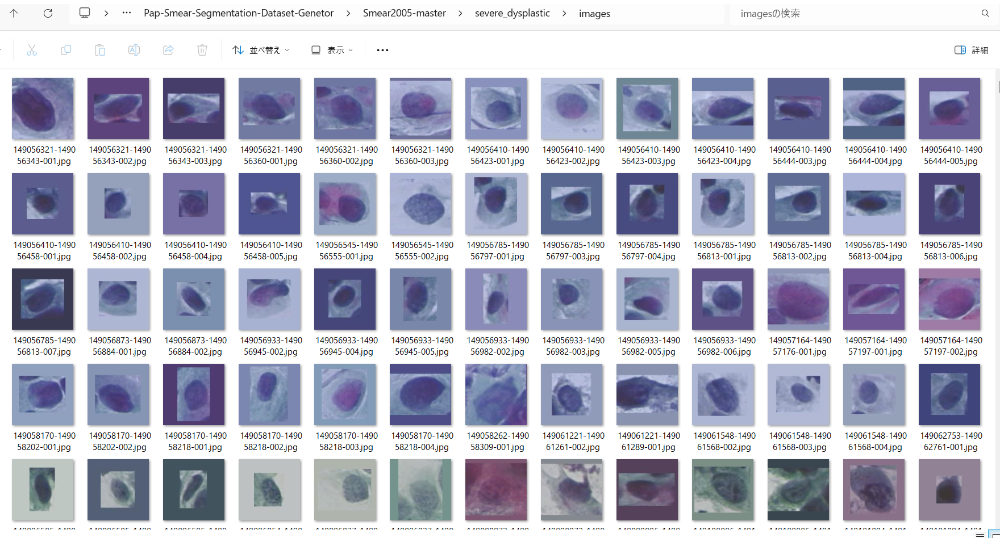
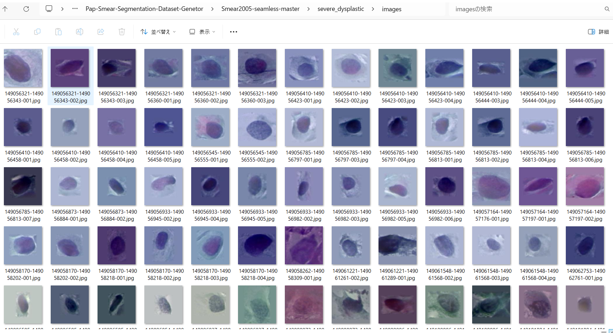
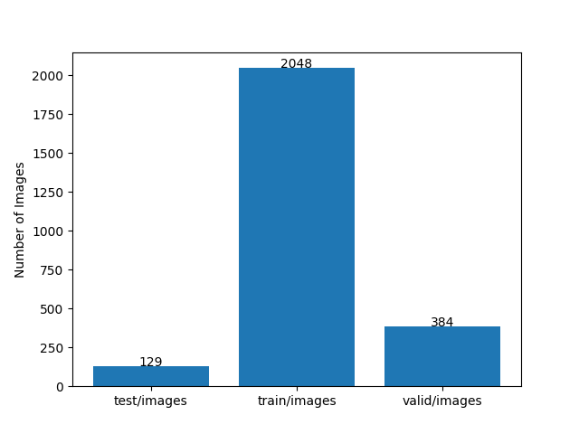
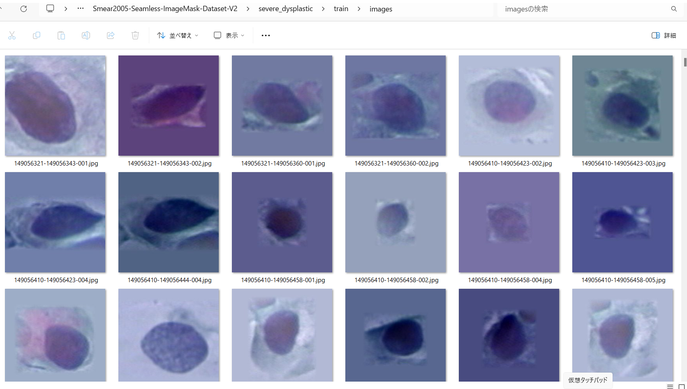
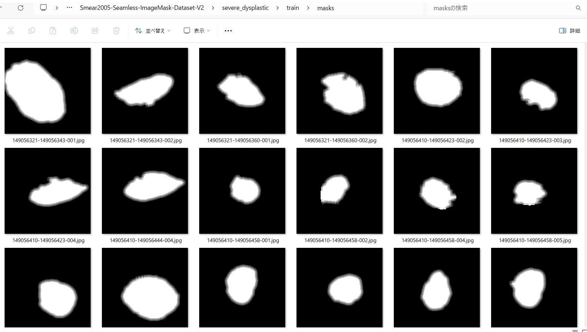

<h2>ImageMask-Dataset-Pap-Smear</h2>

This is a ImageMask Dataset for Pap-Smear Image Segmentation. 
Please see also our first experiment <a href="https://github.com/sarah-antillia/Image-Segmentation-Pap-Smear">Image-Segmentation-Pap-Smear</a>. 
We have generated a dataset of larger image size of 512x512 than that of 128x128 of the first experiment. 

You can download the ImageMask-Dataset-Pap-Smear-V2 created by us from the google drive
<a href="https://drive.google.com/file/d/1s6TYPD8nSto8X_M6u3ectf-RdXFVk-1M/view?usp=sharing">Smear2005-Seamless-ImageMask-Dataset-V2.zip</a>
 
<h3>1. Dataset Citatiion</h3>

The image dataset used here has been taken from the following web site.

<pre>
PAP-SMEAR (DTU/HERLEV) DATABASES & RELATED STUDIES
https://mde-lab.aegean.gr/index.php/downloads/
Part II : smear2005.zip [85.17 MB] New Pap-smear Database (images)
</pre>
<pre>
This is the new website that hosts the DTU/Herlev Pap Smear Databases, as well as selected studies and papers 
related to these data. For more than 10 years, Dr Jan Jantzen works on pap-smear data acquired from images of 
healthy & cancerous smears coming from the Herlev University Hospital (Denmark), thanks to Dr MD Beth Bjerregaard.
The Old Pap Smear Database was formed in the late 90’s while the New Pap Smear Database (improved) was formed 
within 2005. The analysis of these databases was made through several Master Theses most of which where elaborated 
in Denmark, under the supervision of Dr Jantzen, while he was joining DTU, Dept. of Automation (Denmark) and also 
through collaboration to other researchers from around the world, many of which were made with G.Dounias and his
research team of the MDE-Lab, University of the Aegean. During the last years, Dr Jantzen collaborates with the 
University of the Aegean, Dept. of Financial and Management Engineering (FME) as teaching associate of the 
Postgraduate Program of the FME-Dept. and as research associate of the MDE-Lab. The site will be continuously 
updated with new papers, studies, theses and citations related to the hosted pap-smear databases.

In case you use material from this site, please cite the current link and related studies.
</pre>
<h3>2. Prepare dataset</h3>

<h3>2.1 Download master dataset</h3>
  Please download the original image and mask dataset smear2005.zip from the following link 
<pre>
PAP-SMEAR (DTU/HERLEV) DATABASES & RELATED STUDIES
https://mde-lab.aegean.gr/index.php/downloads/
Part II : smear2005.zip [85.17 MB] New Pap-smear Database (images)
</pre>
The dataset <b>New database pictures</b> has the following folder structure, which contains seven categories. 
<pre>
./New database pictures
├─carcinoma_in_situ
├─light_dysplastic
├─moderate_dysplastic
├─normal_columnar
├─normal_intermediate
├─normal_superficiel
└─severe_dysplastic
</pre>
 
<h3>2.2 Create image and mask dataset</h3>
Please run the following bat file to create a master dataset from <b>New database pictures</b> dataset. 
<pre>
./seamless_generator.bat
</pre>.
, which simply runs a Python script <a href="./ImageMaskDatasetGenerator.py">ImageMaskDatasetGenerator.py</a>,
By using this script, we have created <b>Smear2005-seamless-master</b> dataset from the original image *.BMP files and mask *-d.bmp files
in each category under <b>New database pictures</b> folder. 
The script performs the following image processings. 
<pre>
1 Create square images from original BMP files in those categories.
2 Create square mask  corresponding to blue only regions in *-d.bmp mask files in those categories.
3 Create rotated and flipped images and masks of  512x512 pixel-size to augment the resized square images and masks.
</pre>
In this datatset generation process, we have used <b>cv2.seamlessClone</b> of OpenCV API to create seamless augmented image 
from the orginal small images of various sizes in <b>New database pictures</b> dataset. 
 
You can easily see the difference between the non-seamless and seamless images from the following two pictures. 
 
Non-seamless images 
 
 
Seamless images 
 

 
The created <b>Smear2005-seamless-master</b> dataset has the following folder structure. 
<pre>
./Smear2005-seamless-master
├─carcinoma_in_situ
│  ├─images
│  └─masks
├─light_dysplastic
│  ├─images
│  └─masks
├─moderate_dysplastic
│  ├─images
│  └─masks
├─normal_columnar
│  ├─images
│  └─masks
├─normal_intermediate
│  ├─images
│  └─masks
├─normal_superficiel
│  ├─images
│  └─masks
└─severe_dysplastic
    ├─images
    └─masks
</pre>

<h3>2.3 Split Smear2005-seamless-master to test, train and valid </h3>
To simplify the discussion, we will divide the dataset of <b>severe_dysplastic</b> only into three 
subsets: train, validation, and test.

By using Python script <a href="./split_seamless_master.py">split_seamless_master.py</a>,
 we have finally created <b>Smear2005-Seamless-ImageMask-Dataset-V2</b> dataset from the <b>Smear-2005-master/severe_dysplastic</b>. 
<pre>
./Smear2005-Seamless-ImageMask-Dataset-V2
└─severe_dysplastic
    ├─test
    │  ├─images
    │  └─masks
    ├─train
    │  ├─images
    │  └─masks
    └─valid
        ├─images
        └─masks
</pre>

Dataset Statistics 
 

Seamless severe_dysplastic/train/images 
  

Seamless severe_dysplastic/train/mask 
  

